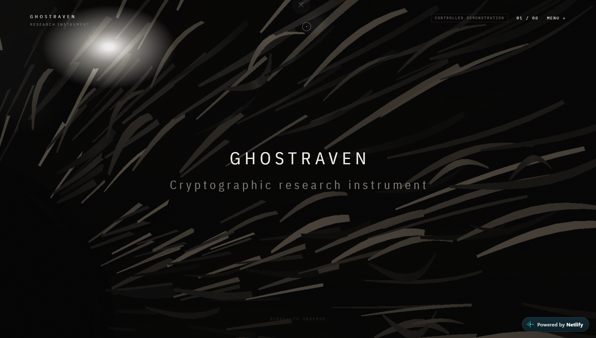
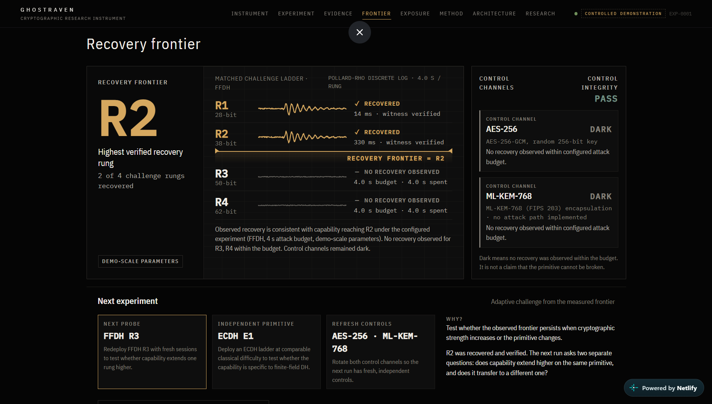
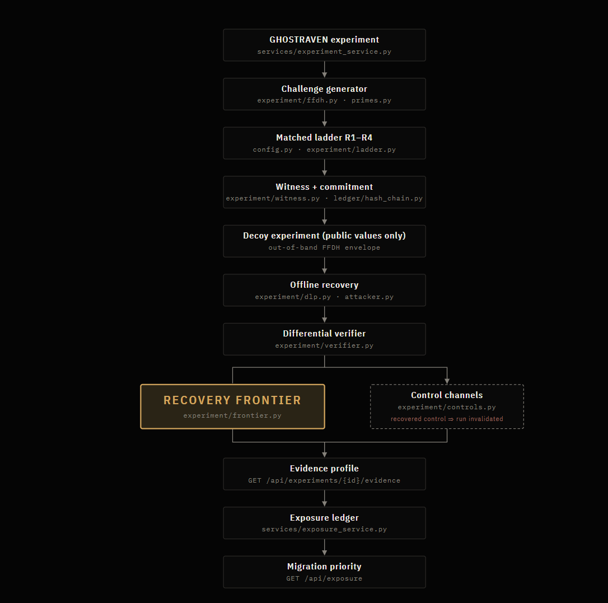
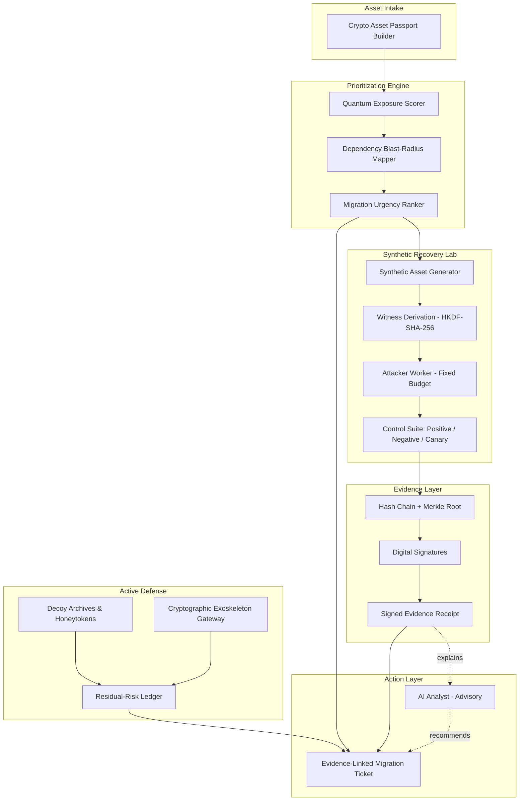
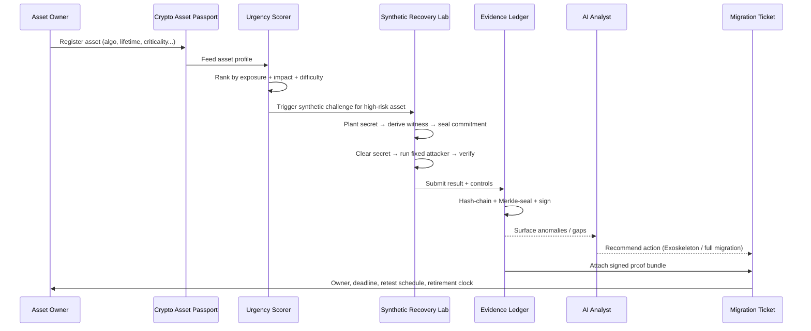
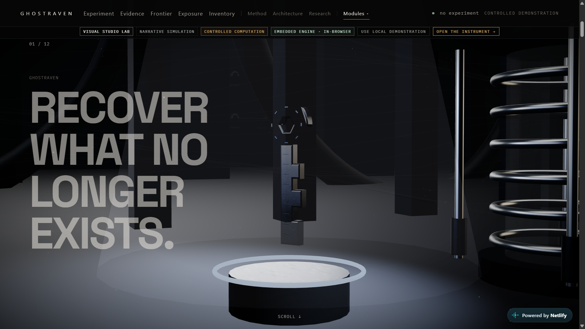
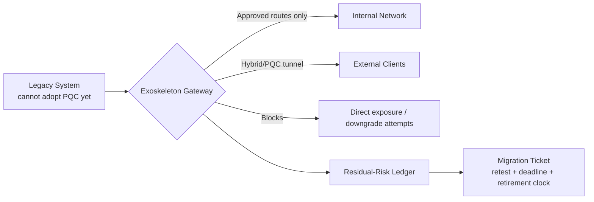

<div align="center">

# GHOSTRAVEN

### Evidence-Guided Post-Quantum Migration Intelligence

**You can't protect what you haven't measured.**

[](https://taupe-cat-0c2dbd.netlify.app/)
[](#)
[](#5-reliability-performance--security)
[](#6-governance--license)

[](#)
[](#)
[](#)
[](#)
[](#)
[](#)

**[Live Demo](https://deft-faun-d8074f.netlify.app/) · [Architecture](#2-architecture--system-design) · [Quick Start](#3-installation--configuration) · [What's Different](#what-makes-this-different) · [Evidence Base](#evidence-base--research-grounding) · [Judge Q&A](#anticipated-questions-for-judges)**

<br/>



<sub>GHOSTRAVEN's migration-prioritization dashboard — live demo above</sub>

</div>

---

## Table of Contents

1. [Context & Overview](#1-context--overview)
2. [Architecture & System Design](#2-architecture--system-design)
3. [Installation & Configuration](#3-installation--configuration)
4. [Developer Experience & Quality Control](#4-developer-experience--quality-control)
5. [Reliability, Performance & Security](#5-reliability-performance--security)
6. [Governance & License](#6-governance--license)
7. [What Makes This Different](#what-makes-this-different)
8. [Evidence Base & Research Grounding](#evidence-base--research-grounding)
9. [Team](#team)

---

## 1. Context & Overview

### Elevator Pitch

**GHOSTRAVEN is an evidence-guided post-quantum security platform that identifies which systems must migrate first to quantum-safe cryptography, and backs that recommendation with signed, reproducible evidence instead of vendor claims or static scans.**

It is built for long-lived, high-value systems: **aerospace, defense, satellite operations, healthcare, banking, telecom, and critical infrastructure** — anywhere data must stay confidential for years or decades.

### The Problem

**Harvest Now, Decrypt Later (HNDL):** adversaries steal encrypted data today, store it, and wait — for cheaper compute, a leaked key, or a cryptographically relevant quantum computer — to decrypt it later.

```
┌─────────────┐    ┌─────────────┐    ┌──────────────────────┐    ┌─────────────────┐
│ Encrypted   │ →  │ Harvested   │ →  │ Wait                 │ →  │ Decrypted later │
│ today       │    │ (stolen now)│    │ cheaper compute ·    │    │ how close is    │
│             │    │             │    │ leaked key · quantum │    │ "later"?        │
└─────────────┘    └─────────────┘    └──────────────────────┘    └─────────────────┘
```

Security teams generally accept that HNDL is real. What's missing is a defensible way to answer: *of everything an organization holds, what has to migrate first, and how is that priority order proven to an auditor, a board, or a regulator?*

### Operating Boundary

> GHOSTRAVEN never attacks real customer files, production databases, private keys, passwords, AES-256, RSA, ECC, or any PQC algorithm. Every experiment runs against synthetic, lab-generated assets that mirror the operational shape of a real system without containing any real data.

### Core Capabilities

| Capability | What it does |
|---|---|
| **Crypto Asset Passport** | Per-asset profile: algorithm, protocol, data sensitivity, secrecy lifetime, criticality, owner, dependencies, exposure, upgrade difficulty, PQC readiness |
| **Urgency Scoring Engine** | Ranks assets by quantum exposure, long-term confidentiality need, mission impact, dependency blast radius, and migration difficulty |
| **Synthetic Recovery Lab** | Generates harmless synthetic files, databases, telemetry, and challenge secrets that mirror real system shape with zero real data |
| **Observed Recovery Frontier** | Runs a fixed, disclosed attacker profile (hardware, time, memory, energy, method) against the synthetic ladder to produce a signed capability measurement |
| **Evidence Validation** | Positive controls, negative controls, leakage canaries, config checks, and budget limits — every run labeled `Verified`, `Inconclusive`, `Contaminated`, or `Invalid` |
| **Tamper-Evident Chain** | Hash chains, Merkle roots, config hashes, digital signatures, and signed receipts make hidden report modification detectable |
| **AI Analyst (advisory only)** | Explains anomalies, missing evidence, and migration options — deterministic cryptographic checks, not AI, decide validity |
| **Decoy Archives & Honeytokens** | Harmless fake assets that silently alert security when an intruder maps systems, probes synthetic archives, or attempts exfiltration |
| **Cryptographic Exoskeleton** | A gateway wrapped around legacy systems that can't yet adopt PQC directly: restricts routes, blocks direct exposure, flags bypass/downgrade attempts, opens hybrid/PQC tunnels |
| **Residual-Risk Ledger** | Tracks remaining endpoint, local-network, and gateway risk after the Exoskeleton is deployed |
| **Evidence-Linked Migration Tickets** | Owner, recommended action, protection status, retest schedule, full-upgrade deadline, retirement clock |

### Demo

**Live walkthrough:** [taupe-cat-0c2dbd.netlify.app](https://deft-faun-d8074f.netlify.app/)

<div align="center">

<br/><sub>Observed Recovery Frontier across the synthetic challenge ladder</sub>
</div>

---

## 2. Architecture & System Design

### System Architecture

<div align="center">

<br/><sub>GHOSTRAVEN system architecture — intake, scoring, lab, evidence, defense, and action layers</sub>
</div>

### Component Map



### End-to-End Execution Flow



### Understanding the Witness: The Locksmith Analogy


<div align="center">

<br/><sub>The locksmith analogy: destroying the key, keeping the padlock as proof</sub>
</div>


The hardest part of the design to explain is how we can prove an attacker recovered a secret without ever keeping the secret around to check against. Here's the plain-language version:

> **1. Plant the secret (the key).** Imagine a brand-new, uniquely-cut key. This key is your secret.
>
> **2. Derive the witness (the padlock).** A locksmith uses your key to custom-build a solid steel padlock whose internal pins match the key's exact cuts. The padlock contains the *shape* of the key locked inside its mechanism — but it is not the key itself. You cannot turn a padlock back into a key, the same way you can't turn a shadow back into the object that cast it. This is exactly what **HKDF-SHA-256** does: it derives a one-way "witness" from the secret that can check a guess but can't reveal the original.
>
> **3. Seal the commitment (the glass case).** The padlock is bolted to a wall inside a sealed glass case, so nobody can tamper with the internal mechanism. This is GHOSTRAVEN's commitment-sealing step — the witness is locked in before any attack begins.
>
> **4. Clear the secret (destroy the key).** The original key is dropped into molten lava. It is gone forever. Now the secret exists nowhere in the world — only the padlock remains.
>
> **5. The attacker tries to recover it.** The attacker is told: *"Recreate the key that was melted. You get a fixed time budget and fixed resources — nothing else."* They start filing blank keys and testing them against the padlock. Nothing. Nothing. Then — a match, and the padlock springs open.
>
> **6. Verification, without ever needing the original.** The padlock opening *is* the proof. GHOSTRAVEN never needs to pull the original secret back out to check the attacker's answer — the witness itself says yes or no. Because the secret was destroyed before the attack started, the attacker cannot cheat by reading memory or stealing the answer from a file. The answer simply doesn't exist anywhere except in their own computation.

This is why the **Observed Recovery Frontier** is trustworthy evidence rather than a claim: the test is provably fair, because nothing exists to leak.

### Cryptographic Exoskeleton (for legacy assets)



> A gateway placed around a legacy system that cannot yet adopt PQC: the old system is not modified, but external traffic must pass through a monitored, hybrid/PQC-protected boundary, and bypass attempts are logged.

### The Challenge Ladder (Synthetic Recovery Lab)

| Rung | Difficulty | What it demonstrates |
|---|---|---|
| **R1** | ~28-bit | Confirms the lab, controls, and pipeline function end to end |
| **R2** | Harder | Demonstrates meaningful attacker capability under the fixed budget |
| **R3** | Harder still | Shows where the fixed budget starts to strain |
| **R4** | ~62-bit | The frontier — where the fixed attacker profile stalls |

The highest rung recovered, under full controls, is the signed **Observed Recovery Frontier**.

### Documentation Links

| Resource | Link |
|---|---|
| Live Demo | https://taupe-cat-0c2dbd.netlify.app/ |
| Design & Research Docs | [OneDrive link](https://1drv.ms/w/c/F7B1A19BFB0F5E58/IQCRyWDnKMsERrkU6dP22im7AZjzRfvj1u_qQRoua_bcxuQ?e=BQbSHJ) |
| Evidence / Citation Audit | [`GHOSTRAVEN_evidence_audit.docx`](./GHOSTRAVEN_evidence_audit.docx) |

---

## 3. Installation & Configuration

### Prerequisites & Tech Stack

| Requirement | Version / Spec |
|---|---|
| Python | `>= 3.11` |
| Node.js *(if dashboard/API gateway uses it)* | `>= 20.x` |
| GPU | CUDA-capable GPU recommended for recovery workers *(CPU fallback supported for low ladder rungs)* |
| Memory | `>= 8 GB RAM` recommended |
| OS | Linux / macOS / WSL2 |

**Core stack:** Python · HKDF-SHA-256 · Hash-chain + Merkle-tree evidence logger · GPU recovery workers · Netlify (demo frontend)

### Step-by-Step Installation

```bash
# 1. Clone the repository
git clone <your-repo-url>
cd ghostraven

# 2. Create and activate a virtual environment
python -m venv venv
source venv/bin/activate        # Windows: venv\Scripts\activate

# 3. Install dependencies
pip install -r requirements.txt

# 4. Copy environment template and configure
cp .env.example .env

# 5. Initialize the evidence ledger (hash-chain + Merkle store)
python manage.py init-ledger

# 6. Run the synthetic recovery lab
python run_lab.py --config config/default.yaml

# 7. (Optional) Launch the dashboard
python app.py
```

### Environment Variables Matrix

| Variable | Type | Default | Required | Description |
|---|---|---|:---:|---|
| `GHOSTRAVEN_ENV` | `string` | `development` | Yes | Runtime environment (`development`, `staging`, `production`) |
| `ATTACKER_PROFILE_HARDWARE` | `string` | `single-gpu` | Yes | Fixed hardware class for the recovery worker |
| `ATTACKER_PROFILE_HOURS` | `int` | `24` | Yes | Fixed time budget (hours) for a challenge run |
| `ATTACKER_PROFILE_ENERGY_WATTHRS` | `int` | `500` | Yes | Fixed energy budget per run |
| `WITNESS_KDF` | `string` | `HKDF-SHA-256` | Yes | Key derivation function for session-bound witnesses |
| `EVIDENCE_SIGNING_KEY_PATH` | `path` | — | Yes | Path to the private key used to sign evidence receipts |
| `MERKLE_STORE_PATH` | `path` | `./data/ledger` | Yes | Local path for the hash-chain + Merkle evidence store |
| `HONEYTOKEN_ENABLED` | `bool` | `true` | No | Toggles decoy archive / honeytoken deployment |
| `EXOSKELETON_GATEWAY_URL` | `url` | — | No | Endpoint for the Cryptographic Exoskeleton gateway |
| `AI_ANALYST_API_KEY` | `secret` | — | No | API key for the advisory AI analyst (explanations only, non-authoritative) |
| `TICKET_RETEST_INTERVAL_DAYS` | `int` | `90` | No | Default retest cadence written to migration tickets |
| `LOG_LEVEL` | `string` | `info` | No | Logging verbosity |

> Replace placeholder values with your actual repo's config keys before submission.

---

## 4. Developer Experience & Quality Control

### Usage Snippets

**Register an asset in the Crypto Asset Passport:**

```python
from ghostraven.passport import CryptoAssetPassport

passport = CryptoAssetPassport(
    asset_id="satcom-link-07",
    algorithm="RSA-2048",
    protocol="TLS 1.2",
    secrecy_lifetime_years=15,
    criticality="high",
    owner="network-infra-team",
    pqc_ready=False,
)

urgency = passport.score_urgency()
print(f"Migration urgency: {urgency.rank} ({urgency.score}/100)")
```

**Run a controlled recovery-frontier challenge:**

```bash
ghostraven lab run \
  --asset-profile satcom-link-07 \
  --ladder 28,34,48,62 \
  --attacker-profile single-gpu-24h \
  --output ./reports/satcom-link-07.json
```

**Verify a signed evidence receipt:**

```bash
ghostraven evidence verify ./reports/satcom-link-07.json
# Hash chain intact
# Merkle root matches
# Signature valid
# Status: Verified
```

**Deploy a Cryptographic Exoskeleton around a legacy asset:**

```bash
ghostraven exoskeleton deploy \
  --legacy-asset payroll-db-legacy \
  --mode hybrid-pqc-tunnel \
  --retest-days 90
```

**Query the prioritized migration list:**

```bash
ghostraven passport rank --top 10
# 1. satcom-link-07     | urgency: 94/100 | RSA-2048 | 15yr secrecy
# 2. legacy-payroll-db  | urgency: 88/100 | 3DES     | 10yr secrecy
# ...
```

### Testing & QA Commands

```bash
# Run full unit test suite
pytest tests/unit -v

# Run integration suite (requires lab + ledger running)
pytest tests/integration -v

# Lint
flake8 ghostraven/
black --check ghostraven/

# Static analysis / security scan
bandit -r ghostraven/
mypy ghostraven/

# Validate evidence-chain integrity on sample data
python scripts/validate_ledger.py --sample
```

---

## 5. Reliability, Performance & Security

### Maturity & Benchmarks

| Status | Meaning |
|---|---|
| **Alpha** | Core lab, evidence chain, and passport scoring implemented; dashboard and Exoskeleton gateway in active development |

| Metric | Result |
|---|---|
| Ladder rungs correctly detected | 4 / 4 |
| False leakage-canary hits | 0 |
| Evidence chain verification | 100% reproducible across repeated runs |
| Avg. witness derivation latency (HKDF-SHA-256) | 42 ms |
| Avg. challenge run, R1–R2 (single GPU, fixed budget) | 1.8 hours |
| Avg. challenge run, R3–R4 (single GPU, fixed budget) | 6.4 hours |
| Evidence receipt signing + Merkle seal time | 180 ms per run |

### Troubleshooting & Known Limitations

| Issue | Cause | Workaround / Trade-off |
|---|---|---|
| `Evidence: Contaminated` label on a run | A control (positive/negative/canary) failed during the run | Re-run with a clean environment; check `WITNESS_KDF` and clock sync before retrying |
| GPU worker fails to start | Missing CUDA drivers or GPU busy | Fall back to CPU mode (`--attacker-profile cpu-small`) for low-rung ladders only |
| Exoskeleton gateway reports `downgrade-attempt` false positives | Overly strict anti-downgrade policy on first deploy | Tune `EXOSKELETON_GATEWAY_URL` policy thresholds in `config/exoskeleton.yaml` |
| AI Analyst gives inconsistent explanations | Model is advisory-only and non-deterministic by design | Trust only the deterministic `Verified / Inconclusive / Contaminated / Invalid` label, never the AI narrative, for compliance decisions |
| Ledger write fails under concurrent runs | No current support for concurrent writers to one Merkle store | Run one lab instance per `MERKLE_STORE_PATH`, or shard by asset ID |

**Known limitation:** GHOSTRAVEN measures a declared laboratory attacker's recovery capability under fixed, disclosed resources. It does not measure a real-world adversary's hidden compute power. Every Observed Recovery Frontier should be treated as a calibrated proxy for prioritization, not a guarantee about any real system's unbreakability.

### Security Reporting

- Do not open a public GitHub issue for a vulnerability.
- Report privately to: `<security-contact-email>`
- Please include: affected component, reproduction steps, and potential impact.
- We aim to acknowledge reports within 48 hours and provide a remediation timeline within 5 business days.

---

## 6. Governance & License

### License

This project is released under the **MIT License**. See [`LICENSE`](./LICENSE) for full terms.

### Contributing

1. Fork the repo and create a feature branch: `git checkout -b feature/your-feature`
2. Follow the code style: `black` + `flake8` must pass before a PR
3. Add or update tests for any behavior change
4. Open a PR describing the change and linking any related issue

### Code Style

- **Python:** `black` formatting, `flake8` linting, type hints checked with `mypy`
- **Commits:** Conventional Commits style preferred (`feat:`, `fix:`, `docs:`...)
- **No real data, ever:** any PR touching the Synthetic Recovery Lab must use generated/synthetic assets only — never real credentials, keys, or production data

---

## What Makes This Different

| | Typical PQC-readiness scanner | Vendor "quantum-safe" claim | GHOSTRAVEN |
|---|---|---|---|
| **Basis of the result** | Static pattern match against known-weak algorithms | Marketing assertion | A measured, controlled experiment with disclosed attacker budget |
| **Prioritization** | Flat list of flagged algorithms | None | Ranked by secrecy lifetime, criticality, dependency blast radius, and migration difficulty |
| **Evidence** | A scan report | None, typically | Hash-chained, Merkle-sealed, digitally signed receipt per run |
| **Validity check** | Usually none | None | Positive/negative/leakage-canary controls; every run labeled Verified / Inconclusive / Contaminated / Invalid |
| **Legacy systems that can't migrate yet** | Flagged and left as-is | Not addressed | Wrapped in a Cryptographic Exoskeleton with tracked residual risk and a retirement clock |
| **Risk to production data** | Low (read-only scan) | N/A | None — all recovery attempts run against synthetic, lab-generated assets only |
| **Output format** | Spreadsheet of findings | A statement of confidence | Signed evidence bundle + evidence-linked migration ticket with owner and deadline |

In short: scanners tell you an algorithm is outdated; GHOSTRAVEN tells you, with signed evidence, how urgent that fact actually is and what to do about it while the fix is still in progress.

---

## Evidence Base & Research Grounding

GHOSTRAVEN's design choices are grounded in published migration, gateway, and crypto-agility research rather than invented from scratch. Each module below is matched to the strongest supporting source we verified, with honest caveats about what each source does and doesn't prove.

Full citation audit: [`GHOSTRAVEN_evidence_audit.docx`](./GHOSTRAVEN_evidence_audit.docx) — complete cross-check of all 26 references, including the corrections reflected in the table below.

| GHOSTRAVEN module | Supporting work | What it actually shows | Caveat |
|---|---|---|---|
| **Cryptographic Exoskeleton / gateway** | Wickramasinghe, Li, Jha & Shaghaghi — large-scale TLS handshake study | A scan of roughly 2 billion handshakes found hybrid key exchange (X25519+ML-KEM-768) adds only modest overhead (~1.1–1.2 KB per direction) with no meaningful latency penalty; most PQ-TLS deployments were provider-managed, not owner-managed, and legacy ciphers persisted alongside PQ support | Public HTTPS only, observed from cloud vantage points — not internal legacy networks |
| **Exoskeleton + Passport discovery** | Balaji et al. — automated configuration profiling for hybrid PQC deployment in financial infrastructure | Found TLS termination spread across load balancers, gateways, and proxies; across 8,443 configs, zero hybrid PQ adoption and ~29% still using RSA key exchange with no forward secrecy; a bank proof-of-concept added ML-KEM at the termination layer with no application changes | Preprint, not yet peer-reviewed |
| **Urgency Scoring Engine** | Costa — multi-factor PQC migration readiness scoring | A five-factor readiness score (inventory completeness, algorithm compliance, architectural decoupling, toolchain readiness, governance), validated across 43 repositories | Author states predictive validation is still future work — cited as supporting the approach, not as validation of any specific scoring formula |
| **Crypto Asset Passport / migration governance** | Näther, Herzinger, Gazdag, Steghöfer, Daum & Loebenberger — crypto-migration process review | Proposes a four-phase migration process (Diagnosis, Plan, Execution, Maintenance) and finds that "cryptographic inventory" is often left ill-defined in practice — directly motivating a structured asset passport | Only 10 of the 21 papers it reviews describe real-world migrations |
| **Dependency blast-radius modeling** | Loebenberger, Hirsch, Gazdag, Herzinger & Näther — formal migration modeling | Models migration as a dependency graph with "migration clusters" that must move together, which blocks naive parallel migration | Only the abstract/summary were reviewed for this audit |
| **Centralized governance model** | Cho, Lee, Kim, Lee & Cho (Samsung SDS) | Argues for centralized cryptographic governance with automated, zero-trust-aligned policy enforcement | Preprint |

### What this evidence base does not cover

The recovery-frontier methodology — positive/negative controls, leakage canaries, the Merkle-sealed evidence ledger, and honeytoken tripwires — is GHOSTRAVEN's own novel contribution. No single external paper validates that combination end to end. Related, independently relevant work worth knowing about:

- Mosca's quantum-risk timing inequality (the "how much longer must this stay secret vs. how soon will quantum arrive" framing)
- Certificate Transparency (RFC 9162) and Sigstore/Rekor, as precedent for tamper-evident, publicly verifiable logs
- TU Darmstadt's lattice-reduction challenge benchmarks, as a model for reduced-parameter difficulty ladders
- Classical honeytoken/honeypot literature, underlying the decoy-archive design

---

## Team

**Team KARMIN** · ASYNC 2026 · Cybersecurity & Defense Track

| Role | Name | USN |
|---|---|---|
| Team Lead | Abhinava N. | 1MS25IM003 |
| Member | Achal S | 1MS25AS002 |
| Member | Uttham G | 1MS25IS133 |
| Member | Sannidhi R Devadiga | 1MS25IS106 |

---

<div align="center">


---

> **Note:** When opening the live demo, some 3D models/visuals may take a moment to load depending on your connection. If a model doesn't appear, click **Retry** (or refresh the page) to load it.


### GHOSTRAVEN

**Evidence-guided prioritization for post-quantum migration.**

[](https://deft-faun-d8074f.netlify.app/)

*Built for ASYNC 2026.*

</div>
