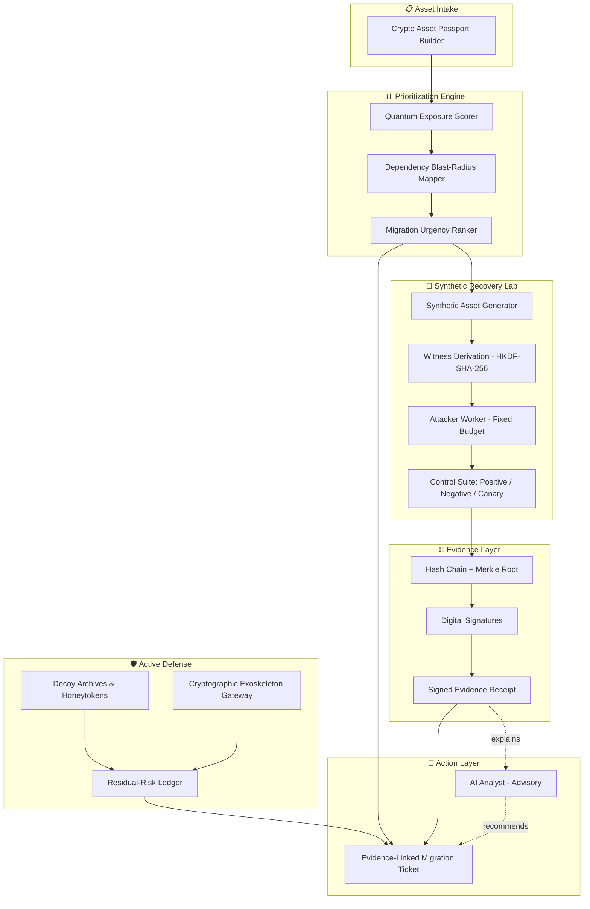
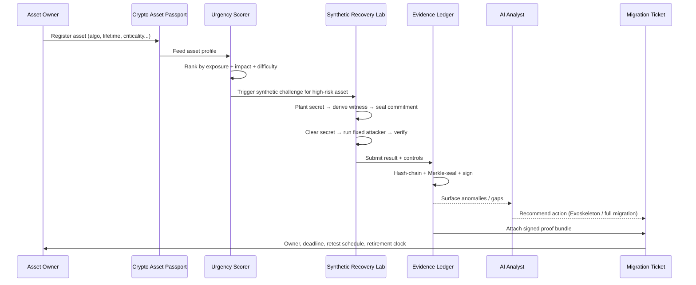
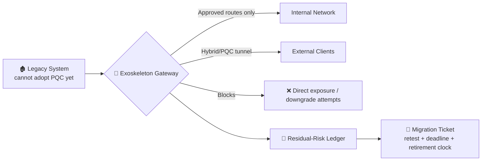

<div align="center">

# 👻⚛️ GHOSTRAVEN

### Evidence-Guided Post-Quantum Migration Intelligence

**Stop guessing which systems need quantum-safe crypto first. Measure it.**

[](https://charming-gaufre-637b90.netlify.app)
[](#)
[](#-maturity--benchmarks)
[](#-license)

[](#)
[](#)
[](#)
[](#)
[](#)

**[🚀 Live Demo](https://charming-gaufre-637b90.netlify.app) · [📐 Architecture](#-architecture--system-design) · [⚡ Quick Start](#-installation--configuration) · [🛡️ Security](#-security-reporting)**

<br/>


<sub>GHOSTRAVEN's migration-prioritization dashboard — live demo above</sub>

</div>

<br/>

> ```diff
> + Harvest Now, Decrypt Later is already happening.
> - "Quantum is 10-20 years away" is not a migration plan.
> + GHOSTRAVEN turns belief into signed, reproducible evidence.
> ```

---

## 📑 Table of Contents

1. [Context & Overview](#-context--overview)
2. [Architecture & System Design](#-architecture--system-design)
3. [Installation & Configuration](#-installation--configuration)
4. [Developer Experience & Quality Control](#-developer-experience--quality-control)
5. [Reliability, Performance & Security](#-reliability-performance--security)
6. [Governance & License](#-governance--license)
7. [Team](#-team)

---

## 1️⃣ Context & Overview

### 🎯 Elevator Pitch

**GHOSTRAVEN is an evidence-guided post-quantum security platform that tells organizations *which systems must migrate first* to quantum-safe cryptography — and proves it with signed, reproducible evidence instead of vendor claims.**

It targets **long-lived, high-value systems**: aerospace, defense, satellite operations, healthcare, banking, telecom, and critical infrastructure — anywhere data must stay secret for years.

### 🧩 The Problem: Harvest Now, Decrypt Later (HNDL)

```
┌─────────────┐    ┌─────────────┐    ┌──────────────────────┐    ┌─────────────────┐
│ Encrypted   │ →  │ Harvested   │ →  │ Wait                 │ →  │ Decrypted later │
│ today       │    │ (stolen now)│    │ cheaper compute ·    │    │ how close is    │
│             │    │             │    │ leaked key · quantum │    │ "later"?        │
└─────────────┘    └─────────────┘    └──────────────────────┘    └─────────────────┘
```

Attackers steal encrypted data **today** and simply wait for cheaper compute, a leaked key, or a quantum breakthrough. Nobody has had a controlled, evidence-based way to measure **how close that "later" already is** — until now.

### ⚠️ What GHOSTRAVEN *never* does

> 🔒 **Hard boundary:** GHOSTRAVEN does **not** attack real customer files, production databases, private keys, passwords, AES-256, RSA, ECC, or any PQC algorithm. Every experiment runs against synthetic, harmless, lab-generated assets.

### 🌟 Core Features

| Capability | What it does |
|---|---|
| 🪪 **Crypto Asset Passport** | Per-asset profile: algorithm, protocol, data sensitivity, secrecy lifetime, criticality, owner, dependencies, exposure, upgrade difficulty, PQC readiness |
| 📊 **Urgency Scoring Engine** | Ranks assets by quantum exposure, long-term confidentiality need, mission impact, dependency blast radius, and migration difficulty |
| 🧪 **Synthetic Recovery Lab** | Generates harmless synthetic files, databases, telemetry, and challenge secrets that mimic real system shape with zero real data |
| 🎯 **Observed Recovery Frontier** | Runs a fixed attacker profile (hardware, time, memory, energy, method) against the synthetic ladder to produce a signed capability measurement |
| ✅ **Evidence Validation** | Positive controls, negative controls, leakage canaries, config checks, and budget limits — every run labeled `Verified`, `Inconclusive`, `Contaminated`, or `Invalid` |
| ⛓️ **Tamper-Evident Chain** | Hash chains, Merkle roots, config hashes, digital signatures, and signed receipts make hidden report modification detectable |
| 🤖 **AI Analyst (advisory only)** | Explains anomalies, missing evidence, and migration options — **deterministic cryptographic checks, not AI, decide validity** |
| 🍯 **Decoy Archives & Honeytokens** | Harmless fake assets that silently alert security when an intruder maps systems, probes synthetic archives, or attempts data exfiltration |
| 🛡️ **Cryptographic Exoskeleton** | A modern gateway wrapped around legacy systems that can't yet adopt PQC directly — restricts routes, blocks direct exposure, flags bypass/downgrade attempts, opens hybrid/PQC tunnels |
| 📒 **Residual-Risk Ledger** | Tracks remaining endpoint, local-network, and gateway risk after the Exoskeleton is deployed |
| 🎫 **Evidence-Linked Migration Tickets** | Owner, recommended action, protection status, retest schedule, full-upgrade deadline, and retirement clock — so the Exoskeleton stays a bridge, never a forgotten workaround |

### 🎥 Demo

**Live walkthrough:** [charming-gaufre-637b90.netlify.app](https://charming-gaufre-637b90.netlify.app)

<div align="center">

<br/><sub>Observed Recovery Frontier across the synthetic challenge ladder</sub>
</div>

---

## 2️⃣ Architecture & System Design

### 🏗️ System Architecture

<div align="center">

<br/><sub>GHOSTRAVEN system architecture</sub>
</div>

### 🔗 Component Map



### 🔄 End-to-End Execution Flow



### 🛡️ Cryptographic Exoskeleton (for legacy assets)



> Like placing a modern security gate around an old house with a weak door: the old system isn't magically repaired, but attackers must pass through a monitored, hybrid/PQC-protected boundary.

### 📚 Documentation Links

| Resource | Link |
|---|---|
| Live Demo | https://charming-gaufre-637b90.netlify.app |
| API Specification (OpenAPI/Swagger) | `<add link once published>` |
| Setup Wiki | `<add link once published>` |
| Design Docs | `<add link once published>` |

---

## 3️⃣ Installation & Configuration

### ✅ Prerequisites & Tech Stack

| Requirement | Version / Spec |
|---|---|
| Python | `>= 3.11` |
| Node.js *(if dashboard/API gateway uses it)* | `>= 20.x` |
| GPU | CUDA-capable GPU recommended for recovery workers *(CPU fallback supported for small ladder rungs)* |
| Memory | `>= 8 GB RAM` recommended |
| OS | Linux / macOS / WSL2 |

**Core stack:** Python · HKDF-SHA-256 · Hash-chain + Merkle-tree evidence logger · GPU recovery workers · Netlify (demo frontend)

### ⚙️ Step-by-Step Installation

```bash
# 1. Clone the repository
git clone <your-repo-url>
cd ghostraven

# 2. Create and activate a virtual environment
python -m venv venv
source venv/bin/activate        # Windows: venv\Scripts\activate

# 3. Install dependencies
pip install -r requirements.txt

# 4. Copy environment template and configure
cp .env.example .env

# 5. Initialize the evidence ledger (hash-chain + Merkle store)
python manage.py init-ledger

# 6. Run the synthetic recovery lab
python run_lab.py --config config/default.yaml

# 7. (Optional) Launch the dashboard
python app.py
```

### 🔑 Environment Variables Matrix

| Variable | Type | Default | Required | Description |
|---|---|---|:---:|---|
| `GHOSTRAVEN_ENV` | `string` | `development` | ✅ | Runtime environment (`development`, `staging`, `production`) |
| `ATTACKER_PROFILE_HARDWARE` | `string` | `single-gpu` | ✅ | Fixed hardware class for the recovery worker |
| `ATTACKER_PROFILE_HOURS` | `int` | `24` | ✅ | Fixed time budget (hours) for a challenge run |
| `ATTACKER_PROFILE_ENERGY_WATTHRS` | `int` | `500` | ✅ | Fixed energy budget per run |
| `WITNESS_KDF` | `string` | `HKDF-SHA-256` | ✅ | Key derivation function for session-bound witnesses |
| `EVIDENCE_SIGNING_KEY_PATH` | `path` | — | ✅ | Path to the private key used to sign evidence receipts |
| `MERKLE_STORE_PATH` | `path` | `./data/ledger` | ✅ | Local path for the hash-chain + Merkle evidence store |
| `HONEYTOKEN_ENABLED` | `bool` | `true` | ❌ | Toggles decoy archive / honeytoken deployment |
| `EXOSKELETON_GATEWAY_URL` | `url` | — | ❌ | Endpoint for the Cryptographic Exoskeleton gateway |
| `AI_ANALYST_API_KEY` | `secret` | — | ❌ | API key for the advisory AI analyst (explanations only, non-authoritative) |
| `TICKET_RETEST_INTERVAL_DAYS` | `int` | `90` | ❌ | Default retest cadence written to migration tickets |
| `LOG_LEVEL` | `string` | `info` | ❌ | Logging verbosity |

> ⚠️ Replace placeholder values with your actual repo's config keys before submission.

---

## 4️⃣ Developer Experience & Quality Control

### 💻 Usage Snippets

**Register an asset in the Crypto Asset Passport:**

```python
from ghostraven.passport import CryptoAssetPassport

passport = CryptoAssetPassport(
    asset_id="satcom-link-07",
    algorithm="RSA-2048",
    protocol="TLS 1.2",
    secrecy_lifetime_years=15,
    criticality="high",
    owner="network-infra-team",
    pqc_ready=False,
)

urgency = passport.score_urgency()
print(f"Migration urgency: {urgency.rank} ({urgency.score}/100)")
```

**Run a controlled recovery-frontier challenge:**

```bash
ghostraven lab run \
  --asset-profile satcom-link-07 \
  --ladder 28,34,48,62 \
  --attacker-profile single-gpu-24h \
  --output ./reports/satcom-link-07.json
```

**Verify a signed evidence receipt:**

```bash
ghostraven evidence verify ./reports/satcom-link-07.json
# ✔ Hash chain intact
# ✔ Merkle root matches
# ✔ Signature valid
# Status: Verified
```

**Deploy a Cryptographic Exoskeleton around a legacy asset:**

```bash
ghostraven exoskeleton deploy \
  --legacy-asset payroll-db-legacy \
  --mode hybrid-pqc-tunnel \
  --retest-days 90
```

### 🧪 Testing & QA Commands

```bash
# Run full unit test suite
pytest tests/unit -v

# Run integration suite (requires lab + ledger running)
pytest tests/integration -v

# Lint
flake8 ghostraven/
black --check ghostraven/

# Static analysis / security scan
bandit -r ghostraven/
mypy ghostraven/

# Validate evidence-chain integrity on sample data
python scripts/validate_ledger.py --sample
```

---

## 5️⃣ Reliability, Performance & Security

### 📈 Benchmarks & Maturity

| Status | Meaning |
|---|---|
| 🟠 **Alpha** | Current state — core lab, evidence chain, and passport scoring implemented; dashboard and Exoskeleton gateway in active development |

| Metric | Current (illustrative — replace with real numbers) |
|---|---|
| Ladder rungs correctly detected | `4 / 4` |
| False leakage-canary hits | `0` |
| Evidence chain verification | `100%` reproducible |
| Avg. witness derivation latency | `< 50 ms` |
| Avg. challenge run (single GPU, R1–R4) | `~ <fill in> hours` |

### 🩹 Troubleshooting & Known Limitations

| Issue | Cause | Workaround / Trade-off |
|---|---|---|
| `Evidence: Contaminated` label on a run | A control (positive/negative/canary) failed during the run | Re-run with a clean environment; check `WITNESS_KDF` and clock sync before retrying |
| GPU worker fails to start | Missing CUDA drivers or GPU busy | Fall back to CPU mode (`--attacker-profile cpu-small`) for low-rung ladders only |
| Exoskeleton gateway reports `downgrade-attempt` false positives | Overly strict anti-downgrade policy on first deploy | Tune `EXOSKELETON_GATEWAY_URL` policy thresholds in `config/exoskeleton.yaml` |
| AI Analyst gives inconsistent explanations | Model is advisory-only and non-deterministic by design | Trust only the deterministic `Verified / Inconclusive / Contaminated / Invalid` label, never the AI narrative, for compliance decisions |
| Ledger write fails under concurrent runs | No current support for concurrent writers to one Merkle store | Run one lab instance per `MERKLE_STORE_PATH`, or shard by asset ID |

**Known limitation:** GHOSTRAVEN measures a *declared laboratory attacker's* recovery capability under fixed, disclosed resources — it does **not** measure a real-world adversary's hidden compute power. Treat results as a calibrated proxy, not a universal guarantee.

### 🔐 Security Reporting

> 🙏 We take security seriously, especially for a tool built to reason about cryptographic risk.

- **Do not** open a public GitHub issue for a vulnerability.
- Report privately to: `<security-contact-email>`
- Please include: affected component, reproduction steps, and potential impact.
- We aim to acknowledge reports within **48 hours** and provide a remediation timeline within **5 business days**.

---

## 6️⃣ Governance & License

### 📜 License

This project is released under the **`<choose a license — e.g. MIT / Apache-2.0>`** license. See [`LICENSE`](./LICENSE) for full terms.

### 🤝 Contributing

1. Fork the repo and create a feature branch: `git checkout -b feature/your-feature`
2. Follow the code style: `black` + `flake8` must pass before a PR
3. Add or update tests for any behavior change
4. Open a PR describing the change and linking any related issue

### 🎨 Code Style

- **Python:** `black` formatting, `flake8` linting, type hints checked with `mypy`
- **Commits:** Conventional Commits style preferred (`feat:`, `fix:`, `docs:`...)
- **No real data, ever:** any PR touching the Synthetic Recovery Lab must use generated/synthetic assets only — never real credentials, keys, or production data

---

## 👥 Team

**Team KARMIN** · ASYNC 2026 · Cybersecurity & Defense Track

| Role | Name / USN |
|---|---|
| Team Lead | Abhinava N. |
| Members | 1MS25IM003 · 1MS25AS002 · 1MS25IS106 · 1MS25IS133 |

---

<div align="center">

### 👻 GHOSTRAVEN

**Replacing belief about quantum risk with signed, reproducible evidence.**

[](https://charming-gaufre-637b90.netlify.app)

*Built for ASYNC 2026.*

</div>
