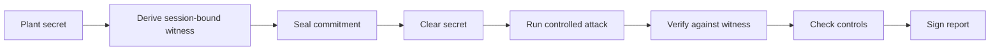

<div align="center">

#  GHOSTRAVEN

### A tamper-evident lab that measures how far a defined attacker can recover a secret.

**Measure it. Don't guess it.**


**[🔗 Live Demo](https://charming-gaufre-637b90.netlify.app)** · **Team KARMIN**

<br/>


</div>

---

##  Table of Contents

- [The Problem](#-the-problem)
- [The Solution](#-the-solution)
- [How It Works](#-how-it-works)
- [The Challenge Ladder](#-the-challenge-ladder)
- [Key Features](#-key-features)
- [What Makes It Different](#-what-makes-it-different)
- [Architecture & Tech Stack](#-architecture--tech-stack)
- [MVP Scope](#-mvp-scope)
- [Demo Walkthrough](#-demo-walkthrough)
- [Success Metrics](#-success-metrics)
- [Impact](#-impact)
- [Scope & Responsible Use](#-scope--responsible-use)
- [Roadmap](#-roadmap)
- [Team](#-team)

---

##  The Problem

In **"Harvest Now, Decrypt Later" (HNDL)** attacks, adversaries steal encrypted data today and wait for cheaper compute, a leaked key, or a quantum breakthrough to unlock it later.

**Nobody has a controlled way to measure how close that "later" already is.**

Vague statements like *"quantum is 10–20 years away"* give organizations no way to decide **which systems to protect first, or how urgently**. Decisions get made on belief, not evidence.

```
Encrypted today  →  Harvested  →  Wait  →  Decrypted later
(data leaves org)   (ciphertext    (cheaper compute,   (how close
                     stolen now)    leaked key, quantum)  is "later"?)
```

### Who is affected

Any organization holding data that must stay secret for years:

| Domain | Examples |
|---|---|
| Defence & Aerospace | Mission data, telemetry, designs |
| Satellite | Long-lived links and keys |
| Medical | Patient records |
| Financial & Legal | Agreements, archives |
| Government | Classified and citizen files |
| IP & AI | Trade secrets, AI-training data |

---

##  The Solution

**GHOSTRAVEN is a controlled lab that measures, not guesses, attacker recovery capability.**

We plant a **synthetic secret**, seal a **tamper-evident "witness"** of it, then let a **strictly defined attacker** (fixed hardware, time, energy, and method) try to recover it across a ladder of increasingly hard challenges.

The result is a defensible, **signed Observed Recovery Frontier**: the highest challenge rung a specific attacker profile could break. Organizations use it to decide **what to re-encrypt first**.

> *"Attacker Profile A recovered up to R2, not R3, within Budget Y."*

---

##  How It Works



| # | Step | Purpose |
|---|---|---|
| 1 | **Plant secret** | Generate a synthetic secret for the challenge |
| 2 | **Derive witness** | Session-bound witness via HKDF-SHA-256 |
| 3 | **Seal commitment** | Lock in the evidence before any attack begins |
| 4 | **Clear secret** | Remove the plaintext so the attacker must truly recover it |
| 5 | **Run attack** | Defined attacker: fixed hardware, time, energy, method |
| 6 | **Verify vs witness** | Check any claimed recovery against the sealed witness |
| 7 | **Check controls** | Positive, negative, and leakage-canary controls |
| 8 | **Sign report** | Emit the signed recovery frontier and proof bundle |

###  Witness Escrow & Split Control

The parties who **generate, seal, attack, and verify** are kept separate, so no single party can fabricate or quietly alter a result.

---

##  The Challenge Ladder

Four rungs of increasing difficulty, from **28-bit** to **62-bit**. The attacker opens the easy rungs and stalls on the hard ones.

<div align="center">


<sub>The Observed Recovery Frontier across the challenge ladder</sub>

</div>

<br/>

| Rung | Difficulty | Outcome under a given attacker |
|---|---|---|
| **R1** | ~28-bit | Easiest, usually recovered |
| **R2** | Harder | Recovered by stronger budgets |
| **R3** | Harder still | Recovered only by the strongest budgets |
| **R4** | ~62-bit | Hardest, the top of the ladder |

The highest rung the attacker recovers is the **Observed Recovery Frontier**.

### 🛩️ Adversary Envelope Testing *(illustrative)*

Same cryptographic asset, multiple attacker budgets, like a flight envelope in aerospace.

| Budget | R1 | R2 | R3 | R4 |
|---|:---:|:---:|:---:|:---:|
| **A** |  recovered |  held |  held |  held |
| **B** |  recovered |  recovered |  held |  held |
| **C** |  recovered |  recovered |  recovered |  held |

---

##  Key Features

-  **Challenge ladder:** four rungs (28-bit to 62-bit) for graded measurement
-  **Session-bound witnesses** derived with HKDF-SHA-256
-  **Commit-then-clear evidence flow:** commitment sealed before the attack starts
-  **Positive, negative, and leakage-canary controls** to validate every run
-  **Hash-chained, Merkle-sealed audit trail** for tamper evidence
-  **Adversary envelope testing** across multiple attacker budgets
-  **Frontier drift detection:** rerun the same benchmark over time to see if recovery gets easier as tools improve
-  **Cross-domain long-life risk mode:** risk weighted by *secrecy duration*, not just current attack cost
-  **Evidence-linked migration tickets:** one per task, with a proof bundle attached
-  **Signed reports** that a CISO or auditor can verify

---

##  What Makes It Different

**We don't claim to break AES-256 or predict quantum computers. We build the missing tool.**

| | Today's alternatives | GHOSTRAVEN |
|---|---|---|
| Claim style | "Unbreakable" or "quantum someday" | "Under this attacker, budget, and challenge family, recovery stopped here" |
| Method | Assertion and marketing | Controlled, reproducible attacker experiments |
| Evidence | None or informal | Sealed, hash-chained, Merkle-verified proof |
| Validation | Trust the vendor | Positive, negative, and leakage-canary controls |
| Output | A vague timeline | A signed, prioritized migration basis |

**The moat:** controls plus a tamper-evident evidence trail turn every run into court-grade proof, with a scientific rigor that marketing claims can't match.

---

##  Architecture & Tech Stack

<div align="center">


<sub>GHOSTRAVEN system architecture</sub>

</div>

<br/>

| Component | Technology | Role |
|---|---|---|
| Challenge generator | **Python** | Builds the ladder and synthetic secrets |
| Witness derivation | **HKDF-SHA-256** | Session-bound witnesses |
| Recovery workers | **GPU** | Run the defined attacker |
| Evidence logger | **Hash chain + Merkle tree** | Tamper-evident audit trail |
| Demo site | **Netlify** | [Live walkthrough](https://charming-gaufre-637b90.netlify.app) |

---

##  MVP Scope

-  Four-rung challenge ladder (28-bit to 62-bit)
-  One defined attacker profile: **single GPU, fixed hours and energy budget**
-  Full **commit → clear → attack → verify** flow with controls
-  Signed report naming the Observed Recovery Frontier

---


##  Demo Walkthrough

1. **Open the live demo:** https://charming-gaufre-637b90.netlify.app
2. **Plant and seal:** a synthetic secret is planted, a witness is derived, and the commitment is sealed
3. **Clear and attack:** the secret is cleared and the defined attacker starts on the ladder
4. **Watch the frontier:** the attacker opens the easy rungs and stalls on the hard ones
5. **Verify:** claims are checked against the witness, and the controls are checked
6. **Signed report:** GHOSTRAVEN names the Observed Recovery Frontier

---

##  Success Metrics

| Metric | Target |
|---|---|
| Ladder rungs correctly detected | **4 / 4** |
| False leakage-canary hits | **0** |
| Verifiable hash-chained audit trail | **100%** |

---

##  Impact

GHOSTRAVEN turns *"the quantum threat is coming"* into a **measured, prioritized migration plan**.

```
Recovery frontier  →  Migration ticket  →  Proof bundle  →  Re-encrypt first
 (signed report)      (one per task)       (as evidence)      (prioritized)
```

Organizations get a documented, defensible basis for which systems to re-encrypt first, grounded in **measured attacker capability instead of guesswork**.

---

##  Scope & Responsible Use

- GHOSTRAVEN operates on **synthetic secrets only** in a controlled lab, never on real data.
- It **does not claim to break AES-256** or forecast quantum computers.
- Results describe a **specific attacker profile and budget**; they are measurements, not universal guarantees.
- Intended for **defensive** use: prioritizing migration and validating protection.

---

##  Roadmap

- [x] Four-rung challenge ladder
- [x] Commit-clear-attack-verify flow with controls
- [x] Hash-chained, Merkle-sealed evidence trail
- [x] Multiple attacker profiles and budgets (adversary envelopes)
- [x] Frontier drift detection over time
- [x] Cross-domain long-life risk scoring
- [x] Evidence-linked migration ticket integration

---

##  Team

**Team KARMIN** · Async 2026 · Cybersecurity & Defense

| Role | Name / USN |
|---|---|
| Team lead | Abhinava N. |
| Members | 1MS25IM003 · 1MS25AS002 · 1MS25IS106 · 1MS25IS133 |

---

<div align="center">

**GHOSTRAVEN**: replacing belief with a signed, reproducible measurement.

*Built for Async 2026.*

</div>
